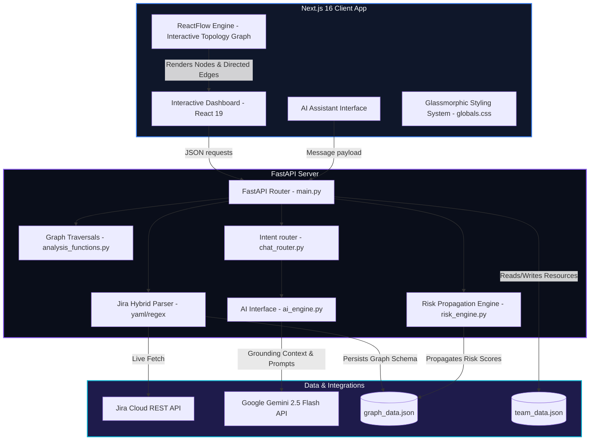

# ⚡ KNOWLEDGE LEDGER
## AI-Driven Enterprise Graph Intelligence & Risk Propagation Platform

> **Hackathon Submission & Project Review Document**  
> **Author:** Debojit Bhattacharjee  
> **Tech Stack:** Next.js 16 + React 19 (ReactFlow) | FastAPI (Python) | Google Gemini 2.5 | Jira Cloud REST API  

---

## ─── 1. EXECUTIVE PROJECT OVERVIEW ──────────────────────────────────────────

### 1.1 The Problem: Enterprise "Microservice Spaghetti"
In modern distributed architectures, engineering teams build and deploy hundreds of microservices. While this microservices model enables fast, decoupled feature releases, it creates a massive visibility challenge:
* **The SRE Blindspot:** When a downstream service (like `payment-api`) experiences an incident, finding which customer-facing applications (projects) are affected requires tracing complex, undocumented system dependencies.
* **Disconnected Operations:** Development tickets reside in Jira, infrastructure states reside in monitoring tools, and team skills profiles reside in HR spreadsheets. There is no unified topological view linking **Projects ↔ Services ↔ Teams ↔ Staff**.
* **Talent Silos during Outages:** When critical systems fail, incident commanders waste valuable minutes searching for who owns the service and who possesses the technical skills (e.g., Spring Boot, Kubernetes) required to fix it.

### 1.2 The Solution: Knowledge Ledger
**Knowledge Ledger** bridges this operational gap by integrating real-time JIRA ticketing, microservice dependency modeling, algorithmic risk propagation, and talent matching into a dynamic, AI-powered system health dashboard.

```
       [ JIRA Service Desks ] ──(Sync)──┐
                                       ▼
  📁 Projects ──(depends_on)──► ⚙️ Services ──(owned_by)──► 👥 Teams
                                   │                          │
                               (depends)                      ├─► 👤 Lead Developer
                                   ▼                          ├─► 👤 DevOps Engineer
                              ⚙️ Services                     └─► 👤 Backend Developer
```

By connecting these layers, Knowledge Ledger enables leaders to:
1. **Visualize** the absolute dependency tree from the client project down to the underlying database services.
2. **Propagate Risk** through a mathematical *Proportional Stress Index* to highlight critical vulnerabilities before they cause total outages.
3. **Execute Blast Radius Analysis** instantly through reverse-graph traversals.
4. **Leverage AI Insights** via Google Gemini to explain elevated risk profiles and suggest mitigation plans using available team skills.

---

## ─── 2. SYSTEM ARCHITECTURE & DATA FLOW ────────────────────────────────────

Knowledge Ledger is designed as a modular, decoupled, full-stack micro-dashboard:



### 2.1 Technology Stack Rationale
* **Frontend: Next.js 16 (React 19) & ReactFlow:** Enables performant rendering of node-based layout structures, utilizing smooth canvas animations, dynamic dragging, and absolute coordinate plotting.
* **Backend: FastAPI:** High-performance, asynchronous REST framework that handles rapid endpoint updates and seamlessly interfaces with Python data science/analytics libraries.
* **Integrations: HTTP Basic Auth to Jira Cloud & REST to Gemini 2.5 Flash:** Provides instantaneous ticket sync and grounding-enabled LLM completions.

---

## ─── 3. CORE LOGIC & ENGINE MECHANISMS ──────────────────────────────────────

### 3.1 Live Jira Synchronization & Hybrid Parsing
Instead of maintaining a heavy, error-prone database state, Knowledge Ledger treats **Jira as the absolute source of truth**. When a sync is triggered, the backend pulls active and resolved incident tickets from Jira and rebuilds the node-edge topology entirely.

The engine parses Jira issue descriptions to construct the graph. It uses a **Dual-Parsing Pipeline** to extract structural system data from text:
1. **YAML Parser:** Attempts to parse the description block as YAML using `yaml.safe_load`.
2. **Regex Fallback Parser:** If YAML parsing fails due to syntax or natural text formatting, the system runs regular expression fallbacks to extract the key tags (`project`, `service`, `owner_team`, `depends_on`).

#### Code Highlight: Fallback Regex Parser (`backend/main.py`)
```python
def _parse_description_fallback(text):
    """Regex-based fallback for parsing Jira descriptions that aren't valid YAML."""
    result = {}
    for field in ["project", "service", "owner_team"]:
        match = re.search(rf'{field}\s*:\s*(.+)', text, re.IGNORECASE)
        if match:
            value = match.group(1).strip().strip('"').strip("'")
            if value:
                result[field] = value

    depends_match = re.search(r'depends_on\s*:\s*(.*)', text, re.IGNORECASE | re.DOTALL)
    if depends_match:
        rest = depends_match.group(1)
        first_line = rest.split('\n')[0].strip()
        if first_line and not first_line.startswith('-') and not first_line.startswith('*'):
            result["depends_on"] = [first_line.strip('"').strip("'")]
        else:
            deps = re.findall(r'[\-\*•]\s*(.+)', rest)
            clean_deps = []
            for dep in deps:
                dep = dep.strip().strip('"').strip("'")
                if ':' in dep:
                    break  # Hit the next YAML key
                if dep:
                    clean_deps.append(dep)
            if clean_deps:
                result["depends_on"] = clean_deps
    return result
```

### 3.2 The Risk Propagation Algorithm
A standout innovation of this system is the **Propagated Stress Index** implemented in `risk_engine.py`. Risk doesn’t live in a vacuum. If a core database service goes down, the applications built on top of it are highly endangered.

The algorithm executes two primary phases:
1. **Proportional Service Stress:** A service node inherits **20%** of the combined base risk of all services that immediately depend on it.
2. **Proportional Project Stress:** A customer-facing *Project* node has a risk score calculated as the **mathematical average** of the risk scores of *all* transitive services in its complete downstream dependency tree (resolved using Breadth-First Search).

```
   [Service C: base risk 50] (Upstream Dependent)
            │
            ▼ (depends_on)
   [Service B: inherits 20% of 50 = +10 risk] (Intermediate)
            │
            ▼ (depends_on)
   [Service A: inherits 20% of B's score] (Downstream Dependency)
```

#### Code Highlight: Propagation Algorithm (`backend/risk_engine.py`)
```python
def propagate_risk():
    nodes = {node["id"]: copy.deepcopy(node) for node in graph_data["nodes"]}
    depends_on = {}  # source -> list of targets
    dependents = {}  # target -> list of sources

    for edge in graph_data["edges"]:
        if edge["label"] == "depends_on":
            source, target = edge["source"], edge["target"]
            if target in nodes and source in nodes:
                depends_on.setdefault(source, []).append(target)
                dependents.setdefault(target, []).append(source)

    # Compute Proportional Stress Index for Services first
    base_risks = {nid: n.get("risk_score", 0) for nid, n in nodes.items()}
    for node_id, node in nodes.items():
        if node.get("type") == "service":
            upstream_services = [
                src for src in dependents.get(node_id, [])
                if nodes[src].get("type") == "service"
            ]
            if upstream_services:
                inherited_stress = sum(base_risks[src] for src in upstream_services) * 0.20
                node["risk_score"] += int(inherited_stress)

    # Compute Risk for Projects (Average of entire transitive ecosystem)
    for node_id, node in nodes.items():
        if node.get("type") == "project":
            transitive_services = get_all_transitive_services(node_id)
            if transitive_services:
                total_risk = sum(nodes[svc_id].get("risk_score", 0) for svc_id in transitive_services)
                node["risk_score"] = int(total_risk / len(transitive_services))
            else:
                node["risk_score"] = 0
    return list(nodes.values())
```

### 3.3 Graph Analytics (Blast Radius & Root Cause)
Knowledge Ledger applies classic graph algorithms to trace systemic impacts:
* **Blast Radius Analysis (Reverse BFS):** Traverses the graph in reverse (from target back to source). If a node fails, the algorithm isolates all services and projects pointing to it, identifying the "Blast Radius count" and assigning an incident severity (`CRITICAL`, `HIGH`, `LOW`).
* **Root Cause Analysis (Forward DFS):** Traverses dependencies forward from an endangered node. It walks down the chain and flags active incidents on downstream dependents that are causing the root stress.

---

## ─── 4. GENERATIVE AI CO-PILOT INTEGRATION ───────────────────────────────────

### 4.1 Intent Routing Pipeline
The dashboard includes an interactive chat companion that understands operational queries. The router (`chat_router.py`) maps user questions to specific analytical tasks through regex keyword matching:

| Intent | Triggers | Action Executed |
|---|---|---|
| `risk_analysis` | `high risk`, `risky`, `risk level` | Fetches elevated projects & services |
| `impact_analysis`| `fails`, `goes down`, `blast radius` | Traverses reverse BFS for targeted node |
| `root_cause` | `why is`, `causing`, `problem with` | Runs forward DFS to find downstream incidents |
| `skills_search` | `who knows`, `skills`, `developers` | Searches team skills profiles |
| `risk_mitigation`| `mitigate`, `fix`, `reduce risk` | Gathers context on node owners, skills, & dependencies |
| `summary` | `executive summary`, `status`, `health` | Generates system-wide analytics report |

### 4.2 LLM Grounding and Safety
To prevent the model from inventing non-existent microservices or assuming root causes, Knowledge Ledger applies strict system instructions.
1. The **exact data output** from the graph traversals/team matches is converted to a clean JSON string.
2. The JSON data is injected into a highly constrained system prompt.
3. The prompt is dispatched to `gemini-2.5-flash`.

#### Example Grounded Prompt Structure:
```
You are an Enterprise AI Management Assistant. You help engineering leaders understand project risks.
RULES:
- ONLY use the data provided below. Do NOT invent information.
- Be concise but thorough (80-150 words).
- Use bullet points for lists.
- Include specific numbers (risk scores, counts) when available.

USER QUESTION: What happens if payment-api fails?
DETECTED INTENT: impact_analysis
ANALYSIS DATA: <Injected reverse BFS JSON containing dependencies and owner teams>
```

---

## ─── 5. COMPLETE REST API SCHEMAS ──────────────────────────────────────────

### 5.1 Graph Endpoint (`/graph` - GET)
* **Description:** Retrieves all node elements (Projects, Services, Teams) with computed risk scores, and the directed relationships (edges) connecting them.
* **Mock Response Structure:**
  ```json
  {
    "nodes": [
      {
        "id": "login-service",
        "label": "Login Service",
        "type": "service",
        "risk_score": 50,
        "incidents": [
          { "title": "Login Failed with correct credentials", "severity": "HIGH" }
        ],
        "latest_incident": "Login Failed with correct credentials"
      },
      {
        "id": "project-atlas",
        "label": "Project Atlas",
        "type": "project",
        "risk_score": 25
      }
    ],
    "edges": [
      { "source": "project-atlas", "target": "login-service", "label": "depends_on" }
    ]
  }
  ```

### 5.2 Incident Sync Endpoint (`/sync-incidents` - POST)
* **Description:** Hits the Jira API using JQL (`project IS NOT EMPTY`), reads ticket attributes and descriptions, parses service topologies, persists them to disk (`graph_data.json`), and outputs metrics.
* **Response Structure:**
  ```json
  {
    "message": "Jira incidents synced successfully",
    "active_incidents": 1,
    "resolved_incidents": 0
  }
  ```

### 5.3 Executive Summary Endpoint (`/summary` - GET)
* **Description:** Analyzes the active topological state, computes counts, isolates critical vulnerabilities, and defines an overall health classification.
* **Response Structure:**
  ```json
  {
    "total_projects": 1,
    "total_services": 3,
    "total_teams": 2,
    "total_members": 11,
    "high_risk_projects": [],
    "high_risk_services": [
      { "label": "Login Service", "risk_score": 50 }
    ],
    "critical_services": [],
    "active_incidents": [
      { "title": "Login Failed with correct credentials", "severity": "HIGH", "service": "Login Service" }
    ],
    "incident_count": 1,
    "most_critical_dependency": {
      "label": "Payment Api",
      "dependents": 2,
      "risk_score": 10
    },
    "overall_health": "AT RISK"
  }
  ```

### 5.4 AI Chat Companion (`/chat` - POST)
* **Description:** Classifies natural language query, compiles graph search context, and generates grounded Gemini completions.
* **Request Payload:**
  ```json
  {
    "message": "Who has Python and Spring Boot skills?",
    "session_id": "8b51d8b9-4a92-49d7-83eb-692552df920f"
  }
  ```
* **Response Structure:**
  ```json
  {
    "reply": "Based on our talent records, **Debojit Bhattacharjee** matches both skills:\n* **Debojit Bhattacharjee** (Lead Developer, Infra Team): Matches **Python** and **Spring Boot** (100% Match).",
    "intent": "skills_search",
    "needs_clarification": false
  }
  ```

---

## ─── 6. INTERACTIVE FRONTEND & GLASSMORPHIC DESIGN ─────────────────────────

The UI is built with premium dashboard aesthetics. It emphasizes color harmony, dynamic interaction, and responsive controls:

* **1. ReactFlow Graph Visualizer:**
  * Uses customized card containers for nodes.
  * **Visual Clues:** Glowing border colors represent service states (Red border/overlay for `CRITICAL` risk ≥ 80; Amber border/overlay for `MODERATE` risk ≥ 50; Dark borders for `HEALTHY`).
  * **Dynamic Edge Animation:** Connections use active dashed line movements (`animated: true`) to illustrate live data traffic flow.
* **2. Multi-Tab Right-Side Inspector:**
  * Collapses smoothly using dynamic CSS width transitions (`transition: width 0.3s ease`).
  * **AI Chat Tab:** Houses the incident conversation assistant. Integrates dynamic "Suggested Question Chips" (e.g. *"What happens if payment-api fails?"*) that trigger automatic queries. Includes a typing indicator dot animation.
  * **Node Details Tab:** Features animated progress meters, dependency arrays, active incident badges, and the targeted AI analysis container.
* **3. Brand Styling System (CSS Variables in `globals.css`):**
  * **Theme:** Deep space cyber-navy (`#0a0e1a` to `#111827`).
  * **Branding Gradients:** Sleek purple-to-blue header headers (`linear-gradient(135deg, #3b82f6, #8b5cf6)`).
  * **Micro-Animations:** Fade-in, shimmer state loads, and pulse glows (`@keyframes pulse-glow`).

---

## ─── 7. HACKATHON VALUE PROPOSITION & JUDGING CRITERIA ──────────────────────

When presenting this application during the hackathon review, emphasize these core high-value achievements:

1. **Practical Real-World Integration:** Most hackathon projects use mock static datasets. Knowledge Ledger connects directly to **live Jira instances** and parses production-style incident formats into actionable dependency models.
2. **Innovative Algorithmic Thinking:** The creation of the *Proportional Stress Index* translates qualitative dependencies into quantitative risk metrics, simulating a real enterprise SRE scenario.
3. **AI Utility vs. Hype:** Generative AI is not used for generic chats. It is strictly grounded in custom graph-traversal contexts, providing zero-hallucination assistance that is highly actionable for incident commanders.
4. **Talent-to-Incident Mapping:** By connecting team profiles directly with system graphs, SRE and DevOps operations move from simple alert reporting to automated resource planning.
5. **Gorgeous Design Excellence:** The visual presentation utilizes glassmorphism, animated flow vectors, custom font weights, and dark modes that deliver an outstanding user experience at first glance.
